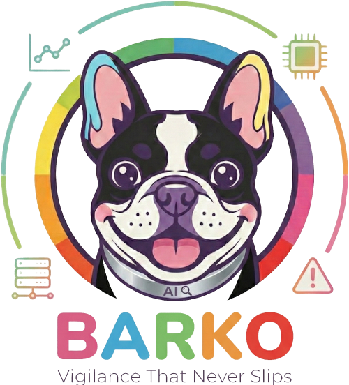

<p align="center">
  
</p>

<h1 align="center">Barko</h1>

<p align="center">
A Next.js web dashboard to monitor and visualize all AI coding agent activity on your local machine. Acts as a single pane of glass for everything Claude Code (and other AI CLI tools) are doing — processes, agent teams, tasks, conversations, skills, MCP servers, configuration, debug logs, and session history.
</p>


## Features

- **Dashboard** — Summary cards with live counts of processes, teams, tasks, and sessions
- **Processes** — Live view of running Claude CLI processes and their child processes
- **Teams** — Agent teams with member avatars, roles, and models
- **Conversations** — Full chat-style viewer for session JSONL files with token usage, tool call inspection, and thinking block expansion
- **Tasks** — All tasks across teams with expandable descriptions, status filtering, and dependency tracking
- **Skills** — Installed plugins with expandable detail (install path, SHA, marketplace)
- **Agents & Tools** — MCP servers (command, args, env keys), plugins with metadata, and marketplace configs
- **Config** — Provider-switchable configuration viewer with CLAUDE.md, settings.json, and MCP server tabs
- **Logs** — Debug log browser with file selection and content viewer
- **History** — Session history with links to full conversation viewer
- **Copyable IDs** — Click-to-copy on every ID, PID, SHA, session ID, and file name throughout the app
- **Real-time updates** — SSE-powered live refresh via chokidar file watching and process polling

## Data Sources

All data is read locally from `~/.claude/`:

| Data | Source | Method |
|------|--------|--------|
| Processes | `ps` command | Poll every 3s via SSE |
| Teams | `~/.claude/teams/*/config.json` | File watch |
| Tasks | `~/.claude/tasks/*/*.json` | File watch |
| Conversations | `~/.claude/projects/*/*.jsonl` | File watch |
| Skills | `~/.claude/plugins/installed_plugins.json` | File watch |
| MCP Servers | `~/.claude/settings.json` → `mcpServers` | File watch |
| Plugin metadata | `cache/*/.claude-plugin/plugin.json` | File read |
| Marketplaces | `~/.claude/plugins/known_marketplaces.json` | File read |
| Config | `~/.claude/CLAUDE.md`, `settings.json` | File watch |
| Debug logs | `~/.claude/debug/*.txt` | File watch |
| History | `~/.claude/projects/*/*.jsonl` | File watch |

## Tech Stack

- **Next.js 16** (App Router) with TypeScript
- **Tailwind CSS v4** for styling
- **Server-Sent Events (SSE)** for real-time updates
- **chokidar** for file system watching
- **Node.js child_process** for process discovery

## Getting Started

### Prerequisites

- Node.js 20+
- npm
- Claude Code installed (data lives in `~/.claude/`)

### Install & Run

```bash
# Clone the repo
git clone https://github.com/your-username/barko.git
cd barko

# Install dependencies
npm install

# Start the dev server
npm run dev
```

Open [http://localhost:3000](http://localhost:3000) in your browser.

### Production Build

```bash
npm run build
npm start
```

### Docker

```bash
docker run -d \
  --name barko \
  --pid=host \
  -p 3000:3000 \
  -v ~/.claude:/home/nextjs/.claude:ro \
  --restart unless-stopped \
  ydrus/barko:latest
```

- `--pid=host` lets Barko see host processes for the Processes page
- The volume mount is read-only -- Barko never writes to `~/.claude/`

## Project Structure

```
src/
├── app/                           # Next.js App Router pages
│   ├── layout.tsx                 # Root layout with sidebar
│   ├── page.tsx                   # Dashboard overview
│   ├── processes/page.tsx         # Claude CLI processes
│   ├── teams/page.tsx             # Agent teams list
│   ├── teams/[name]/page.tsx      # Team detail (members + task board)
│   ├── conversations/page.tsx     # Session list grouped by project
│   ├── conversations/[id]/page.tsx# Conversation viewer
│   ├── tasks/page.tsx             # All tasks with filters
│   ├── skills/page.tsx            # Installed plugins
│   ├── agents/page.tsx            # MCP servers, plugins, marketplaces
│   ├── config/page.tsx            # Config viewer with provider tabs
│   ├── logs/page.tsx              # Debug log browser
│   ├── history/page.tsx           # Session history
│   └── api/                       # API routes (all force-dynamic)
├── lib/                           # Backend data readers
│   ├── providers/                 # Provider abstraction layer
│   │   ├── index.ts               # Interface + aggregators
│   │   └── claude-adapter.ts      # Claude Code implementation
│   ├── claude-paths.ts            # Path constants (~/.claude/*)
│   ├── conversation-reader.ts     # JSONL session parser
│   ├── agent-reader.ts            # MCP/plugin/marketplace reader
│   ├── process-monitor.ts         # ps-based process discovery
│   ├── team-reader.ts             # Team config parser
│   ├── task-reader.ts             # Task JSON parser
│   ├── skill-reader.ts            # Plugin parser
│   ├── config-reader.ts           # CLAUDE.md + settings reader
│   ├── log-reader.ts              # Debug log reader
│   ├── history-reader.ts          # Session history parser
│   └── types.ts                   # Provider-agnostic types
└── components/                    # Reusable UI components
    ├── sidebar.tsx                # Navigation sidebar
    ├── copyable-id.tsx            # Click-to-copy ID component
    ├── message-bubble.tsx         # Chat message with tool calls
    ├── mcp-server-card.tsx        # MCP server display
    ├── plugin-card.tsx            # Plugin display with metadata
    ├── process-card.tsx           # Process display
    ├── team-card.tsx              # Team summary card
    ├── task-row.tsx               # Expandable task row
    ├── skill-card.tsx             # Expandable skill card
    ├── status-badge.tsx           # Status indicator
    ├── config-viewer.tsx          # Markdown/JSON viewer
    ├── log-viewer.tsx             # Log tail viewer
    ├── dashboard-stats.tsx        # Overview stat cards
    └── icons.tsx                  # SVG icon components
```

## Multi-Provider Architecture

The codebase uses a provider abstraction layer (`src/lib/providers/`) designed to support multiple AI CLI tools:

```
AIProviderAdapter (interface)
├── ClaudeAdapter     ← implemented
├── GeminiAdapter     ← planned
├── CursorAdapter     ← planned
└── CopilotAdapter    ← planned
```

Each provider implements the same interface. The config page includes a provider switcher to toggle between them.

## Scripts

| Command | Description |
|---------|-------------|
| `npm run dev` | Start dev server on localhost:3000 |
| `npm run build` | Production build |
| `npm start` | Start production server |
| `npm run lint` | Run ESLint |

## License

[MIT](LICENSE)
