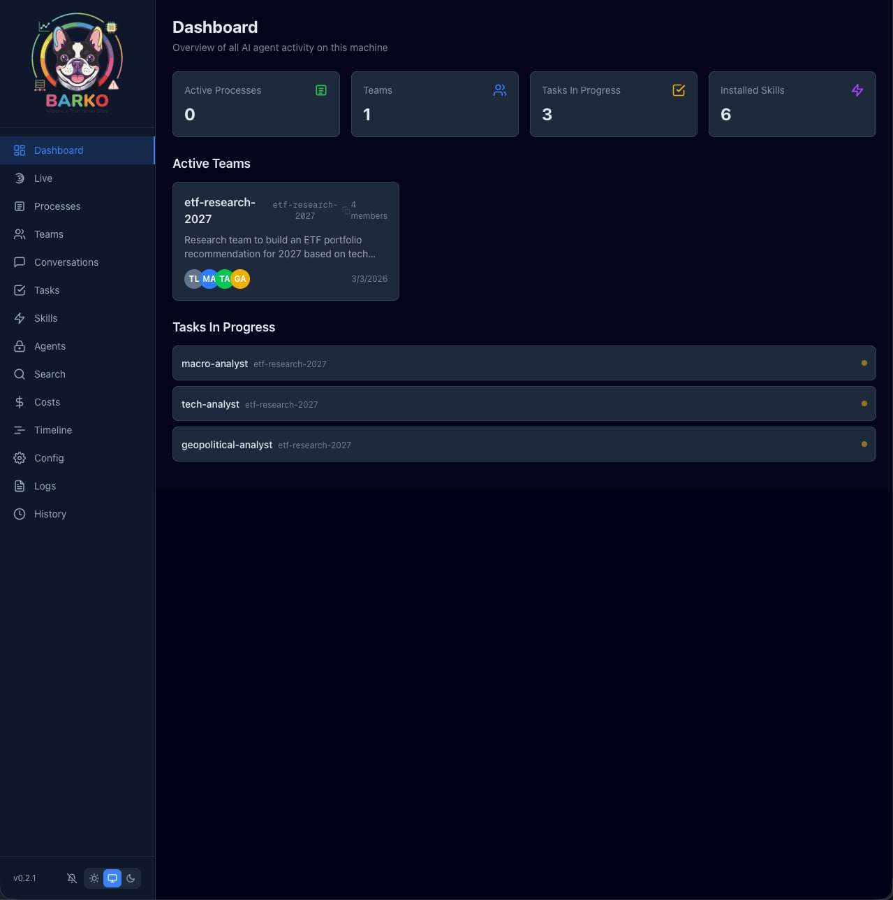

<p align="center">
  
</p>

<h1 align="center">Barko</h1>

<p align="center">
A Next.js web dashboard to monitor and visualize all AI coding agent activity on your local machine. Acts as a single pane of glass for everything Claude Code (and other AI CLI tools) are doing — processes, agent teams, tasks, conversations, skills, MCP servers, configuration, debug logs, and session history.
</p>


## Features

<p align="center">
  
</p>

- **Dashboard** — Summary cards with live counts of processes, teams, tasks, and sessions
- **Processes** — Live view of running Claude CLI processes and their child processes
- **Teams** — Agent teams with member avatars, roles, and models
- **Conversations** — Full chat-style viewer for session JSONL files with token usage, tool call inspection, and thinking block expansion
- **Tasks** — All tasks across teams with expandable descriptions, status filtering, and dependency tracking
- **Skills** — Installed plugins with expandable detail (install path, SHA, marketplace)
- **Agents & Tools** — MCP servers (command, args, env keys), plugins with metadata, and marketplace configs
- **Config** — Provider-switchable configuration viewer with CLAUDE.md, settings.json, and MCP server tabs
- **Logs** — Debug log browser with file selection and content viewer
- **History** — Session history with links to full conversation viewer
- **Copyable IDs** — Click-to-copy on every ID, PID, SHA, session ID, and file name throughout the app
- **Real-time updates** — SSE-powered live refresh via chokidar file watching and process polling

## Getting Started

### Prerequisites

- Docker
- Claude Code installed (data lives in `~/.claude/`)

### Run

```bash
docker run -d \
  --name barko \
  --pid=host \
  -p 3000:3000 \
  -v ~/.claude:/home/nextjs/.claude:ro \
  --restart unless-stopped \
  ydrus/barko:latest
```

Open [http://localhost:3000](http://localhost:3000) in your browser.

- `--pid=host` lets Barko see host processes for the Processes page
- The volume mount is read-only -- Barko never writes to `~/.claude/`

**Note:** On macOS, Docker runs inside a Linux VM so `--pid=host` only exposes the VM's processes, not the macOS host's. The Processes page will be empty. All other features (teams, tasks, conversations, skills, agents, config, logs, history) work normally. On Linux, process monitoring works as expected.

## License

[MIT](LICENSE)
